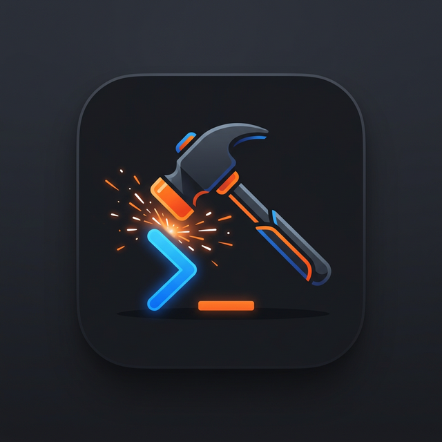

<div align="center">
  
  <h1>ForgeTerm</h1>
  <p>A multi-pane terminal workspace built for builders running multiple projects concurrently.</p>
  
  <p>
    <a href="https://github.com/eliophan/ForgeTerm/releases">
      
    </a>
    <a href="https://github.com/eliophan/ForgeTerm/blob/main/LICENSE">
      
    </a>
  </p>
</div>

<br />

<!-- 
TIPS FOR MAINTAINER: 
Take a beautiful screenshot of ForgeTerm showing multiple split panes working.
Save it to a `docs/` folder or image hosting and replace the link below!
-->
<div align="center">
  
</div>

## Overview

ForgeTerm is designed to optimize the workflow of developers who manage multiple services, databases, and continuous processes at once. Instead of losing track of loose terminal windows, it provides a highly customizable, robust environment out of the box.

- **Multi-pane Layout:** Absolute-positioned tiling window manager for horizontal and vertical terminal splits without layout degradation.
- **Fast & Lightweight:** Built on [Tauri](https://tauri.app/) (Rust backend) ensuring minimal memory footprint compared to Electron alternatives.
- **xterm.js Integration:** Reliable rendering, performance, and full terminal compatibility.
- **File Explorer:** Built-in side panel to easily browse and jump between local working directories.

## Installation 

ForgeTerm is currently optimized for macOS (Windows and Linux support via source build).

1. Go to the [Releases page](https://github.com/eliophan/ForgeTerm/releases).
2. Download the latest `.dmg` file (e.g., `ForgeTerm_0.1.0_aarch64.dmg` for Apple Silicon).
3. Open the `.dmg` and drag **ForgeTerm** to your `Applications` folder.

*Note: If macOS blocks the app, go to System Settings → Privacy & Security → Click "Open Anyway".*

---

## Contributing

We welcome contributions. ForgeTerm is built using the Tauri framework, dividing the application into a web frontend and a system-level backend.

### Project Architecture

```text
ForgeTerm/
├── src/                  # FRONTEND (React + TypeScript + Tailwind)
│   ├── App.tsx           # Main application shell and layout manager
│   ├── features/         # Logic slices (Terminal, Explorer, Git, Layout)
│   └── components/       # Reusable UI components
│
├── src-tauri/            # BACKEND (Rust + Tauri)
│   ├── src/main.rs       # App entry point
│   ├── src/pty.rs        # PTY (Pseudo-Terminal) process management
│   └── tauri.conf.json   # OS permissions and window settings
```

### Prerequisites
- [Node.js](https://nodejs.org/) (v20+)
- [pnpm](https://pnpm.io/) (v9+)
- [Rust](https://www.rust-lang.org/tools/install) (Stable)

### Getting Started

1. Clone the repository:
   ```bash
   git clone https://github.com/eliophan/ForgeTerm.git
   cd ForgeTerm
   ```

2. Install dependencies:
   ```bash
   pnpm install
   ```

3. Run the desktop app in development mode (with Hot-Module Replacement):
   ```bash
   pnpm tauri dev
   ```

### Building from Source

To build production binaries yourself:
```bash
# Compile web frontend
pnpm build

# Compile Desktop app packages (.dmg, .app, .exe, etc)
pnpm tauri build
```

Compiled deliverables will be located in `src-tauri/target/release/bundle/`.

## License

This project is licensed under the [MIT License](LICENSE).
